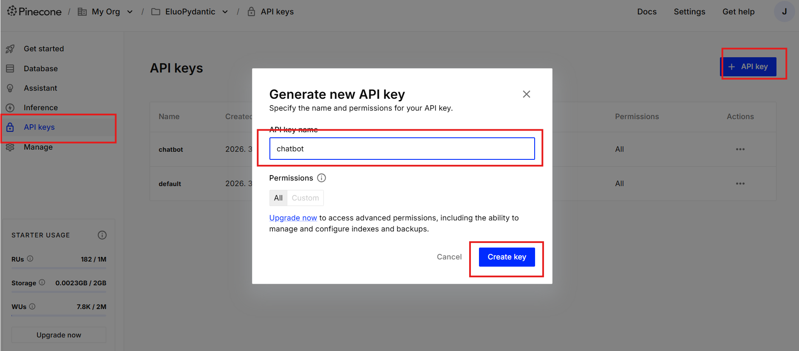
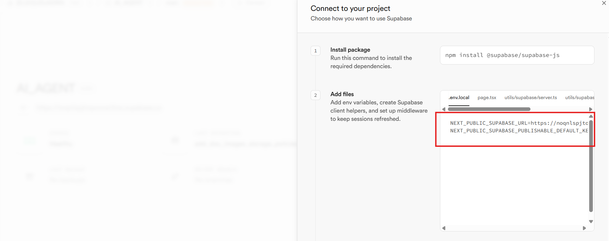
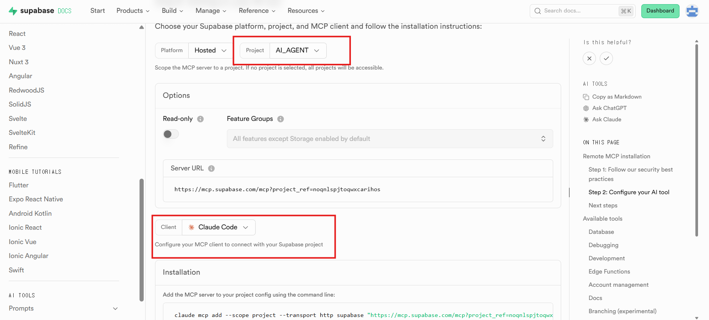

# 프로젝트 마이그레이션 가이드

이 문서는 프로젝트를 다른 사용자의 GitHub 저장소로 완전히 이전하는 절차를 설명합니다.

> 각 단계는 **직접 해야 할 일**과 **Claude Code(프롬프트)에 요청할 일**로 구분되어 있습니다.

---

## Step 1. Git 저장소 이전

### 직접 할 일

1. GitHub에서 빈 repo 생성
2. 터미널에서 아래 명령어 실행:

```bash
git clone https://github.com/jaerinjaerin/agent-with-pydanticai.git
cd agent-with-pydanticai
git remote remove origin
git remote add origin https://github.com/<새사용자>/<새repo이름>.git
git push -u origin main
```

---

## Step 2. 환경변수 발급 및 설정

### 직접 할 일

`.env.example`을 `.env`로 복사하고, 아래 순서대로 각 서비스의 API 키를 발급받아 입력합니다.

#### 2-1. ANTHROPIC_API_KEY

1. [Anthropic Console](https://console.anthropic.com/) 접속 및 회원가입/로그인
2. **API Keys** → **Create Key** → 키 복사
3. `.env`의 `ANTHROPIC_API_KEY`에 붙여넣기

#### 2-2. PINECONE_API_KEY

1. [Pinecone Console](https://app.pinecone.io/) 접속 및 회원가입/로그인
2. 프로젝트 선택 → 좌측 **API Keys** 클릭
3. **+ API key** 클릭 → 이름 입력 → **Create key** 클릭
4. 키를 즉시 복사하여 `.env`에 저장



> 생성 창을 닫으면 키를 다시 확인할 수 없으므로 반드시 바로 복사할 것.

#### 2-3. Supabase 프로젝트 생성 및 키 발급

1. [Supabase](https://supabase.com/) 접속 및 회원가입/로그인
2. Dashboard에서 **New Project** 클릭
3. Organization 선택 → 프로젝트 이름, DB 비밀번호, Region 설정 → **Create new project**
4. 프로젝트 생성 완료 후 URL 클릭



5. 아래 두 값을 `.env`에 복사:
   - **Project URL** → `NEXT_PUBLIC_SUPABASE_URL`
   - **Project API keys → anon / public** → `NEXT_PUBLIC_SUPABASE_PUBLISHABLE_DEFAULT_KEY`

#### 2-4. GEMINI_API_KEY (선택)

> Gemini 임베딩은 Supabase 벡터 검색(대체 백엔드)에서만 사용됩니다.
> 주 검색(Pinecone)만 사용할 경우 발급하지 않아도 됩니다.

1. [Google AI Studio — API Keys](https://aistudio.google.com/app/apikey) 접속 및 Google 계정 로그인
2. 최초 접속 시 이용약관 동의 → 기본 API 키가 자동 생성됨
3. 키를 복사하여 `.env`의 `GEMINI_API_KEY`에 저장

---

## Step 3. 의존성 설치

### Claude Code에 요청할 일

```
"pip install -r requirements.txt 실행해줘"
```

---

## Step 4. Claude Code에 Supabase MCP 연결

### 직접 할 일

1. [Supabase MCP 문서](https://supabase.com/docs/guides/getting-started/mcp) 이동



2. Installation 내용대로 Claude Code에 MCP 서버 추가

### Claude Code에 요청할 일

```
"데이터베이스 테이블 목록을 보여줘"
```
→ 연결이 정상이면 테이블 목록이 표시됩니다.

---

## Step 5. Supabase DB 스키마 적용 + 데이터 입력

두 가지 방법 중 택 1:

### 방법 A: backup.sql로 한번에 복원 (권장)

#### 직접 할 일

1. Supabase Dashboard → **Connect** 클릭
2. **Direct** → Connection Method: **Session pooler** 선택


3. Connection string (URI)을 복사


4. 터미널에서 아래 명령어 실행 (URI의 `[YOUR-PASSWORD]`를 DB 비밀번호로 교체):
```bash
psql "postgresql://postgres.<project-ref>:<비밀번호>@aws-0-<region>.pooler.supabase.com:5432/postgres" < backup.sql
```

> `backup.sql`에 스키마 + 문서 데이터가 모두 포함되어 있습니다.

### 방법 B: MCP로 단계별 적용 (psql 없을 때)

#### Claude Code에 요청할 일

```
"supabase/migrations/001_init.sql 파일을 실행해줘"
```
→ 테이블 4개, 인덱스, hybrid_search RPC 함수가 생성됩니다.

그 다음:

```
"python scripts/migrate_to_supabase.py 실행해줘"
```
→ `data/` 폴더의 JSON 파일이 Supabase `documents` 테이블에 입력됩니다.

---

## Step 6. Supabase Storage 이미지 복원

### 직접 할 일

1. Supabase Dashboard → **Storage** → **New Bucket**
2. 이름: `doc-images`, Public bucket: **ON**

### Claude Code에 요청할 일

```
"data/storage_backup/doc-images 폴더의 파일들을 Supabase Storage doc-images 버킷에 업로드해줘"
```
→ 게시판 인라인 이미지 23개가 업로드됩니다.

---

## Step 7. Pinecone 인덱스 생성 및 데이터 복원

### 직접 할 일

Pinecone Console에서 Integrated Index 생성:
- **Create Index** 클릭
- Index name: `eluocnc-faq-v2`
- Setup: **Integrated** 선택
- Embedding model: `multilingual-e5-large`
- Cloud: `aws`, Region: `us-east-1`

### Claude Code에 요청할 일

```
"data/pinecone_export.json 데이터를 Pinecone eluocnc-faq-v2 인덱스에 업로드해줘"
```

또는 아래 스크립트를 직접 실행:

```python
import json
from pinecone import Pinecone

pc = Pinecone(api_key="<새-PINECONE_API_KEY>")
index = pc.Index("eluocnc-faq-v2")

with open("data/pinecone_export.json", "r") as f:
    records = json.load(f)

batch_size = 100
for i in range(0, len(records), batch_size):
    batch = records[i:i+batch_size]
    index.upsert_records(
        namespace="__default__",
        records=[{"_id": r["id"], **r["metadata"]} for r in batch]
    )
    print(f"Uploaded {min(i+batch_size, len(records))}/{len(records)}")

print("Done!")
```

---

## Step 8. Streamlit Cloud 배포

### 직접 할 일

1. [Streamlit Cloud](https://share.streamlit.io/)에서 로그인 (GitHub 계정)
2. **New app** → GitHub repo 연결
3. Main file: `src/app.py`
4. **Advanced settings → Secrets**에 환경변수 추가 (TOML 형식 — **값을 반드시 따옴표로 감쌀 것**):
   ```toml
   ANTHROPIC_API_KEY = "sk-ant-..."
   PINECONE_API_KEY = "pcsk_..."
   GEMINI_API_KEY = "AI..."
   NEXT_PUBLIC_SUPABASE_URL = "https://xxxx.supabase.co"
   NEXT_PUBLIC_SUPABASE_PUBLISHABLE_DEFAULT_KEY = "eyJ..."
   ```

---

## Step 9. 동작 확인

### 직접 할 일

```bash
# 로컬 테스트
streamlit run src/app.py
```

또는 Streamlit Cloud 배포 URL에서 채팅 테스트.

---

## 체크리스트

| # | 작업 | 유형 | 완료 |
|---|---|---|---|
| 1 | GitHub에 빈 repo 생성 + push | 직접 | [ ] |
| 2 | `.env` 파일에 모든 API 키 설정 | 직접 | [ ] |
| 3 | `pip install -r requirements.txt` | 프롬프트 | [ ] |
| 4 | Supabase MCP 연결 확인 | 직접 + 프롬프트 | [ ] |
| 5 | Supabase DB 스키마 적용 (`001_init.sql`) | 프롬프트 | [ ] |
| 6 | Supabase 문서 데이터 입력 (`migrate_to_supabase.py`) | 프롬프트 | [ ] |
| 7 | Supabase Storage `doc-images` 버킷 생성 + 이미지 업로드 | 직접 + 프롬프트 | [ ] |
| 8 | Pinecone Index 생성 (Console) | 직접 | [ ] |
| 9 | Pinecone 데이터 업로드 (`pinecone_export.json`) | 프롬프트 | [ ] |
| 10 | Streamlit Cloud 배포 + Secrets 설정 | 직접 | [ ] |
| 11 | 챗봇 정상 동작 확인 | 직접 | [ ] |
